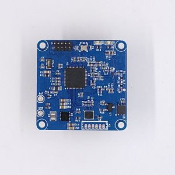
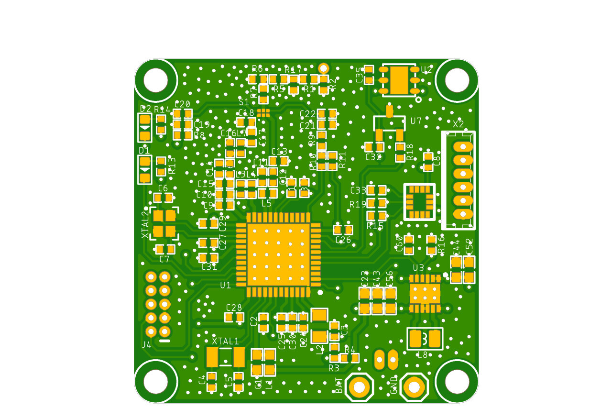
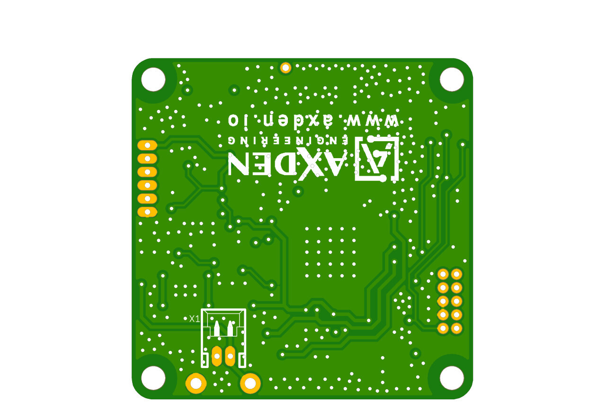
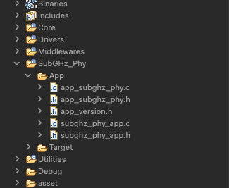
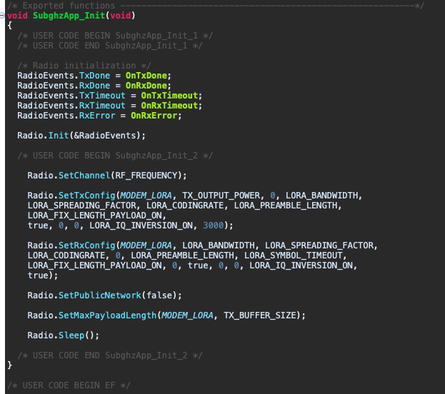
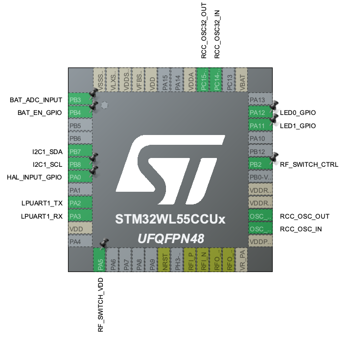

# STM32WL55 6-Axis LoRa Motion Tracker


<br>

STM32WL55 6-Axis LoRa Motion Tracker 은 가속도, 각속도, 온도, GPS 위치와 같은 Asset tracking 에 필요한 핵심적인 정보를 수집하고 태양광 충전을 이용하여 배터리를 충전합니다.
<br>
<br>
1Km 이상의 장거리 통신이 필요한 다양한 서비스 시나리오를 빠르게 테스트 할 수 있도록 제공하는 예제입니다.
<br>
<br>
The STM32WL55 6-Axis LoRa Motion Tracker collects key information required for asset tracking such as acceleration, angular velocity, temperature, and GPS location, and charges the battery using solar power.
<br>
<br>
This is an example that provides quick testing of various service scenarios that require long-distance communication of 1Km or more.
<br>

-----------------------

[네이버 스마트 스토어](https://smartstore.naver.com/axden)
<br>

-----------------------

### 주요 특징 및 기능

MCU | 설명
:-------------------------:|:-------------------------:
STM32WL55 | LoRa SoC

센서 | 설명
:-------------------------:|:-------------------------:
L76 | GPS sensor
MAX2659 | GPS LNA
LSM6DSl | 6 Axis Accelerometer, Gyroscope
Si7051 | Temperature sensor
Si7201 | Hall Sensor
SPV1050 | Solar battery charger (Max charge current 80mA)
Solar | On board
Battery | 3.7V Lithium Battery


LORA 통신이 가능한 Motion tracker 입니다.
<br>

STM32WL55 SoC 를 이용하여 LORA 통신이 가능합니다.
<br>

SI7201 Hall 센서와 자석을 이용하여 On Off 할 수 있습니다.
<br>

LSM6DSL 을 이용하여 가속도, 자이로 센서 값을 수집합니다.
<br>

Si7051 센서를 이용하여 온도 값을 수집합니다.
<br>

배터리를 이용하여 5년동안 사용 가능합니다.
<br>

UART X 1, I2C X 1 를 연결할 수 있는 Connector 가 존재하여 확장이 가능합니다.
<br>


### Note

해당 프로그램으로 예제 프로그램으로 양산 및 상용화에 적합하지 않습니다.
<br>

양산 및 대량 구매 고객께서는 development@axden.io 으로 문의 주시기 바랍니다.
<br>

양산 및 대량 구매 고객분들께는 저전력, 안정화, 게이트웨이와 통신 등 사용하시는 목적에 맞는 최적화된 Firmware 를 무료로 개발해 드립니다.
<br>

<table>
  <tr align="center">
    <td>Top</td>
    <td>Bottom</td>
  </tr>
  <tr align="center">
    <td></td>
    <td></td>
  </tr>
</table>
<br>

Works with STM32CubeIDE Version: 1.8.0, freeRTOS CMSIS_V2, Single-core
<br>

STM32WL55 module only support RFO_H
<br>

RF Switch IC MPN : BGS12SN6E6327XTSA1
<br>


-----------------------

### STM32WL55 Radio setup


<br>

SubGHZ-Phy / App / subghz_phy_app.c

```
#define REGION_AS923

#if defined( REGION_AS923 )

#define RF_FREQUENCY                                923000000 // Hz

#elif defined( REGION_AU915 )

#define RF_FREQUENCY                                915000000 // Hz

#elif defined( REGION_CN470 )

#define RF_FREQUENCY                                470000000 // Hz

#elif defined( REGION_CN779 )

#define RF_FREQUENCY                                779000000 // Hz

#elif defined( REGION_EU433 )

#define RF_FREQUENCY                                433000000 // Hz

#elif defined( REGION_EU868 )

#define RF_FREQUENCY                                868000000 // Hz

#elif defined( REGION_KR920 )

#define RF_FREQUENCY                                920000000 // Hz

#elif defined( REGION_IN865 )

#define RF_FREQUENCY                                865000000 // Hz

#elif defined( REGION_US915 )

#define RF_FREQUENCY                                915000000 // Hz

#elif defined( REGION_RU864 )

#define RF_FREQUENCY                                864000000 // Hz

#else
#error "Please define a frequency band in the compiler options."
#endif

#define TX_OUTPUT_POWER 14

#define LORA_BANDWIDTH                              0         // [0: 125 kHz,
//  1: 250 kHz,
//  2: 500 kHz,
//  3: Reserved]
#define LORA_SPREADING_FACTOR                       10         // [SF7..SF12]
#define LORA_CODINGRATE                             1         // [1: 4/5,
//  2: 4/6,
//  3: 4/7,
//  4: 4/8]
#define LORA_PREAMBLE_LENGTH                        8         // Same for Tx and Rx
#define LORA_SYMBOL_TIMEOUT                         5         // Symbols
#define LORA_FIX_LENGTH_PAYLOAD_ON                  false
#define LORA_IQ_INVERSION_ON                        false

#define TX_BUFFER_SIZE 128
#define RX_BUFFER_SIZE 128

```
<br>


<br>

-------------------------

### STM32WL55 Pin map


